

  
  
  
  
  
  
  

# <code>The Cipher Stack</code>

<table>
  <tr>
    <td width="43%" align="center" valign="top">
      
    </td>
    <td width="57%" align="center" valign="top">
      
    </td>
  </tr>
</table>

---

## <code>About Me</code>

I’m **Shahanur Islam Shagor**, a **Full-Stack Web Developer and AI / Autonomous Systems Engineer** focused on building dependable software and intelligent systems that connect the **web, AI, edge computing, and the physical world**.

My work spans **full-stack product engineering, machine learning, computer vision, autonomous systems, distributed architectures, and applied cybersecurity**. I enjoy taking complex problems from idea to implementation—designing the architecture, building the product, integrating intelligent components, validating performance, strengthening security, and shipping systems that are practical to use and maintain.

Across my projects, I have worked on **scalable web platforms, local-first AI applications, edge-AI systems, UAV navigation and sensor fusion, privacy-preserving machine learning, secure connected systems, and research-driven engineering prototypes**. What matters most to me is not adding technology for its own sake, but choosing the right engineering approach for the problem and making the result reliable in real-world conditions.

I approach engineering with a strong product and systems mindset: **clean architecture, secure-by-design decisions, measurable performance, maintainable code, thoughtful UI/UX, automation, and reliable deployment**. I’m especially interested in work where software must do more than function—it needs to be **useful, resilient, scalable, and technically sound**.

- Based in **Voronezh, Russia · UTC+3**
- Portfolio: **https://smshagor.com**
- GitHub: **@smshagor-dev**
- Email: **smshagor.dev@gmail.com**
- Core Focus: **Full-Stack Engineering · AI/ML · Autonomous Systems · Edge AI · Applied Security**

---

## <code>Contributions</code>

  

> Contribution data is generated automatically by the profile artwork workflow and refreshed daily.

---

<!-- ORCID-PUBLICATIONS:START -->
## <code>Research & Publications</code>

> Automatically synchronized from my public [ORCID record](https://orcid.org/0009-0003-7730-3202) every 6 hours. Last sync: **25 Sep 2026, 21:39 UTC**.

### Published Works

_No works currently classified by ORCID as published/formal outputs._

### Preprints

1. **[Personalized Federated Learning Under Severe Statistical Heterogeneity: A Multi-Dataset Analysis of Accuracy, Tail Performance, and Client Fairness](https://doi.org/10.21203/rs.3.rs-11073326/v1)** — 2026-09-21 · `Preprint`
2. **[An Identity-Aware Permissioned Blockchain Architecture for Secure Connected Vehicle Communication](https://doi.org/10.21203/rs.3.rs-11073229/v1)** — 2026-09-18 · `Preprint`
3. **[Beyond Dirichlet Alpha: Realized Client Heterogeneity for Privacy–Utility–Fairness Evaluation in Federated Learning](https://doi.org/10.21203/rs.3.rs-11072587/v1)** — 2026-09-18 · `Preprint`
4. **[Confidence-Aware ESKF–MSCKF Fusion of Visual–Inertial and UWB/TDOA Measurements for Robust UAV Localization in GPS-Denied Environments](https://doi.org/10.21203/rs.3.rs-11073266/v1)** — 2026-09-18 · `Preprint`
5. **[Post-Quantum and Trust-Aware Authentication for Permissioned Vehicular Blockchains: Session-Amortized V2X Security with Historical Key Continuity](https://doi.org/10.21203/rs.3.rs-11073259/v1)** — 2026-09-18 · `Preprint`
6. **[Tamper-Evident Incident Response and Digital Evidence Management for Connected Vehicles Using Permissioned Blockchain](https://doi.org/10.21203/rs.3.rs-11073242/v1)** — 2026-09-18 · `Preprint`
7. **[WVAB: Temporal Risk-Gated Multimodal Guidance and Trusted Edge Streaming for Offline Assistive Vision](https://doi.org/10.21203/rs.3.rs-11073218/v1)** — 2026-09-18 · `Preprint`
8. **[Replay-Resistant Admission and Permissioned Quorum Consensus in Connected Vehicle Networks: A Fail-Closed, Implementation-Grounded Security Study](https://doi.org/10.21203/rs.3.rs-11047001/v1)** — 2026-09-17 · `Preprint`
9. **[A Severity-Calibrated Adversarial Benchmark for Federated Learning: From Label Corruption to Structured Model-Update Injection](https://doi.org/10.21203/rs.3.rs-10976314/v1)** — 2026-09-10 · `Preprint`
10. **[Native Byzantine-Robust Aggregation for Trustworthy Federated Learning: A C++20 Evaluation of Krum, Multi-Krum, Trimmed Mean, and Coordinate-wise Median](https://doi.org/10.21203/rs.3.rs-10973784/v1)** — 2026-09-10 · `Preprint`
11. **[Policy-Gated Zero-Trust Federated Learning: Identity-Bound Enrollment, Replay-Resistant Control, and Secure Coordination](https://doi.org/10.21203/rs.3.rs-10973795/v1)** — 2026-09-10 · `Preprint`
12. **[Quorum-Bounded Asynchronous Federated Learning under Non-IID Data and Adversarial Clients: A Systems Study of Stale-Update Exclusion and Convergence](https://doi.org/10.21203/rs.3.rs-10975675/v1)** — 2026-09-10 · `Preprint`
13. **[Adaptive Edge Intelligence for Low-Latency Assistive Vision under Dynamic Network and Computational Constraints](https://doi.org/10.21203/rs.3.rs-10901871/v1)** — 2026-09-03 · `Preprint`
14. **[Fabrication-constrained tandem inverse design of photonic crystal fiber SPR sensors with uncertainty-aware Pareto screening](https://doi.org/10.21203/rs.3.rs-10905069/v1)** — 2026-09-03 · `Preprint`
15. **[Risk-Aware Adaptive Video Processing with Freshness Control for Low-Latency Assistive Vision](https://doi.org/10.21203/rs.3.rs-10902455/v1)** — 2026-09-03 · `Preprint`
16. **[A Secure Offline Edge Architecture for Wearable Vision Assistance: Raspberry Pi-ESP32-CAM Integration and Reproducible Software Validation](https://doi.org/10.21203/rs.3.rs-10891677/v1)** — 2026-09-02 · `Preprint`
17. **[WVAB: A Low-Latency Wireless Assistive Vision Framework for Risk-Aware Navigation and Multilingual Audio Guidance](https://doi.org/10.21203/rs.3.rs-10854126/v1)** — 2026-08-31 · `Preprint`
18. **[Toward Blockchain-Assisted Zero-Trust Secure Communication for Decentralized UAV Swarms in GPS-Denied Environments: A Mathematical Security and Scalability Framework](https://doi.org/10.20944/preprints202608.2000.v1)** — 2026-08-27 · `Preprint`
19. **[Cyber-Resilience and Trust-Aware Command Authorization for Autonomous UAV Swarms in GPS-Denied Environments](https://doi.org/10.21203/rs.3.rs-10812590/v1)** — 2026-08-26 · `Preprint`
20. **[Decentralized Coordination and Acoustic Source Localization in Autonomous Drone Swarms](https://doi.org/10.21203/rs.3.rs-10812536/v1)** — 2026-08-26 · `Preprint`
21. **[OmniGuard V2X: A Hybrid-Security Prototype Framework with Assumption-Aware Validation for Smart Vehicle Systems](https://doi.org/10.21203/rs.3.rs-10813996/v1)** — 2026-08-26 · `Preprint`
22. **[Policy-Gated Firmware Trust and Anti-Rollback Resilience for Autonomous UAV Edge Platforms: A Formal Security and Software Validation](https://doi.org/10.21203/rs.3.rs-10812592/v1)** — 2026-08-26 · `Preprint`
23. **[Sequence-, Epoch-, and Integrity-Aware Detection of Replay and Peer-Spoofing Attacks in Decentralized UAV Mesh Networks: A Software-Validated Security Framework](https://doi.org/10.21203/rs.3.rs-10812593/v1)** — 2026-08-26 · `Preprint`
24. **[Toward Secure Decentralized Coordination and Acoustic Source Localization in Autonomous Drone Swarms](https://doi.org/10.21203/rs.3.rs-10530148/v1)** — 2026-07-31 · `Preprint`
25. **[CyberPhotonics-SPR: An auditable research workflow for uncertainty-aware inverse design of PCF-SPR sensors](https://doi.org/10.2139/ssrn.7467869)** — 2026 · `Preprint`

<!-- ORCID-PUBLICATIONS:END -->

---

## <code>Research Projects</code>

My core research portfolio spans **autonomous systems, trustworthy and privacy-preserving AI, cyber-physical security, edge intelligence, V2X, photonic sensing, and safety-oriented industrial AI**.

<table>
<tr>
<td width="50%" valign="top">

<a href="https://github.com/smshagor-dev/UVA-GPS-Denied-Navigation-in-Dynamic-Environments">
  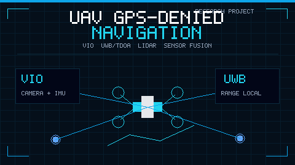
</a>
  

### [UAV GPS-Denied Navigation](https://github.com/smshagor-dev/UVA-GPS-Denied-Navigation-in-Dynamic-Environments)

Autonomous UAV navigation in GPS-denied and dynamic environments using resilient localization, VIO, ESKF-based sensor fusion, UWB/TDOA, LiDAR-aware perception, fault injection, and deterministic validation.

**Research focus:** Autonomous Systems · Robotics · Sensor Fusion · GPS-Denied Navigation

</td>
<td width="50%" valign="top">

<a href="https://github.com/smshagor-dev/decentralized-coordination-and-acoustic-localization-in-secure-autonomousa-drone-swarms">
  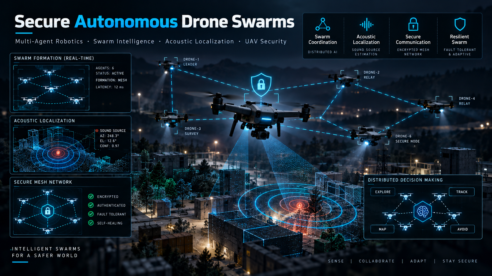
</a>
  

### [Secure Autonomous Drone Swarms](https://github.com/smshagor-dev/decentralized-coordination-and-acoustic-localization-in-secure-autonomousa-drone-swarms)

Research on decentralized coordination, acoustic source localization, secure communication, distributed decision-making, swarm resilience, and cooperative behavior in autonomous UAV systems.

**Research focus:** Multi-Agent Robotics · Swarm Intelligence · Acoustic Localization · UAV Security

</td>
</tr>

<tr>
<td width="50%" valign="top">

<a href="https://github.com/smshagor-dev/Federated-Learning-on-Non-IID-Data-Differential-Privacy">
  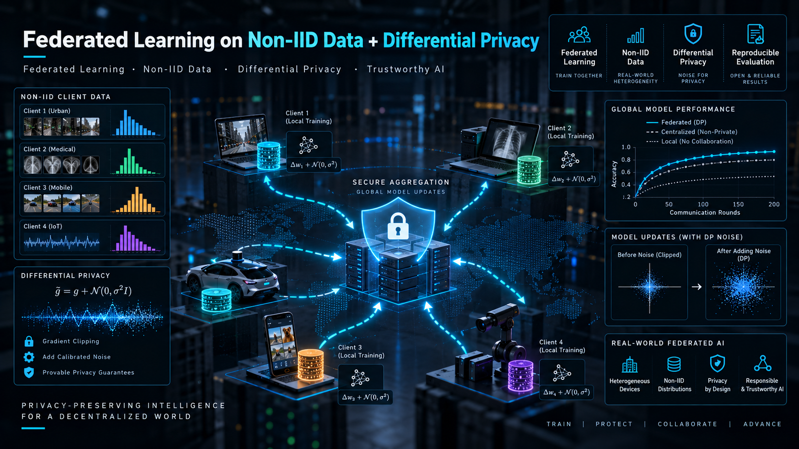
</a>
  

### [Federated Learning on Non-IID Data + Differential Privacy](https://github.com/smshagor-dev/Federated-Learning-on-Non-IID-Data-Differential-Privacy)

Privacy-preserving federated-learning experimentation for heterogeneous non-IID environments, combining distributed training, differential privacy, convergence analysis, and reproducible evaluation workflows.

**Research focus:** Federated Learning · Non-IID Data · Differential Privacy · Trustworthy AI

</td>
<td width="50%" valign="top">

<a href="https://github.com/smshagor-dev/ZeroTrust-FL-Sim">
  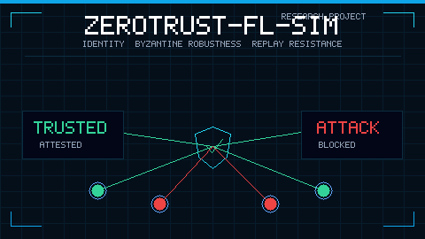
</a>
  

### [ZeroTrust-FL-Sim](https://github.com/smshagor-dev/ZeroTrust-FL-Sim)

A federated-learning security testbed for zero-trust coordination, adversarial clients, Byzantine-robust aggregation, privacy mechanisms, replay-resistant control, secure transport, and systems-level resilience evaluation.

**Research focus:** Secure Federated Learning · Byzantine Robustness · Zero Trust · Privacy-Preserving ML

</td>
</tr>

<tr>
<td width="50%" valign="top">

<a href="https://github.com/smshagor-dev/Next-Gen-Blockchain-for-Vehicle-Security">
  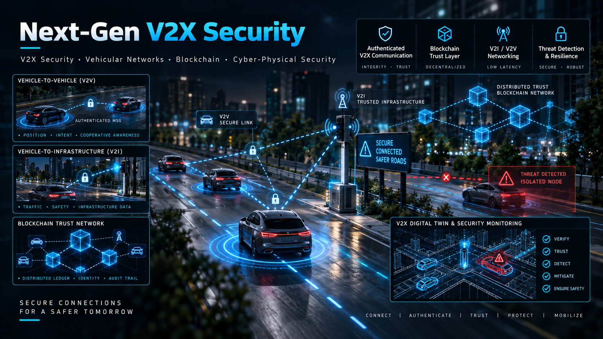
</a>
  

### [Next-Gen V2X Security](https://github.com/smshagor-dev/Next-Gen-Blockchain-for-Vehicle-Security)

Connected-vehicle security research combining decentralized trust, blockchain-assisted coordination, authenticated communication, modern cryptography, post-quantum security concepts, and resilient V2X architecture.

**Research focus:** V2X Security · Vehicular Networks · Blockchain · Cyber-Physical Security

</td>
<td width="50%" valign="top">

<a href="https://github.com/smshagor-dev/wireless-Vision-Aid-for-the-blind">
  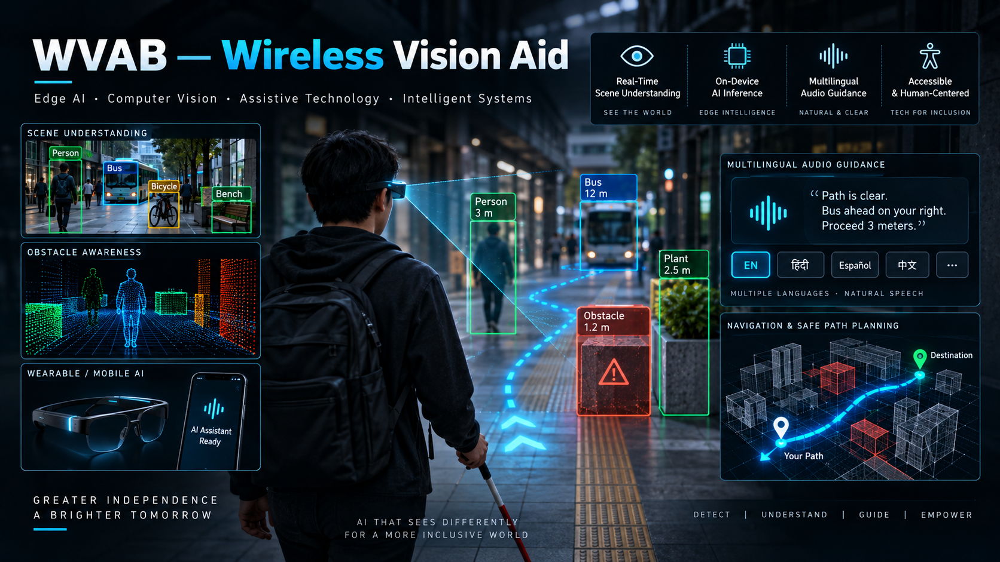
</a>
  

### [WVAB — Wireless Vision Aid](https://github.com/smshagor-dev/wireless-Vision-Aid-for-the-blind)

An edge-computer-vision assistive research platform for real-time scene understanding, object detection, risk-aware navigation, adaptive video processing, wireless inference, and multilingual audio guidance.

**Research focus:** Edge AI · Computer Vision · Assistive Technology · Intelligent Systems

</td>
</tr>

<tr>
<td width="50%" valign="top">

<a href="https://github.com/smshagor-dev/CyberPhotonics-SPR">
  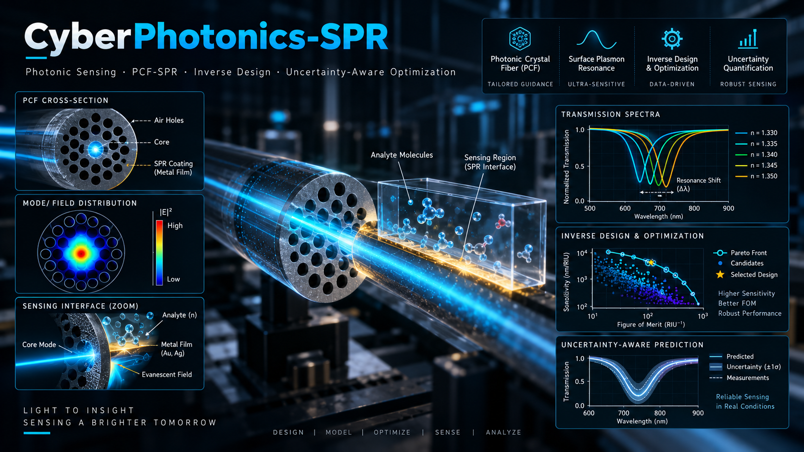
</a>
  

### [CyberPhotonics-SPR](https://github.com/smshagor-dev/CyberPhotonics-SPR)

An auditable research workflow for photonic-crystal-fiber SPR sensing with fabrication-aware inverse design, uncertainty-aware optimization, Pareto screening, reproducible experiments, and software-backed validation.

**Research focus:** Photonic Sensing · PCF-SPR · Inverse Design · Uncertainty-Aware Optimization

</td>
<td width="50%" valign="top">

<a href="https://github.com/smshagor-dev/ForgeSense-AI">
  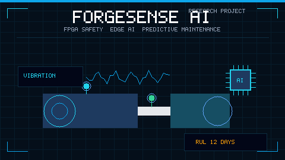
</a>
  

### [ForgeSense AI](https://github.com/smshagor-dev/ForgeSense-AI)

A hardware/software co-design research platform combining deterministic FPGA safety, ESP32-S3 edge intelligence, predictive-maintenance experimentation, protected low-voltage control, evidence-controlled calibration, and auditable maintenance workflows.

**Research focus:** FPGA Safety · Edge AI · Predictive Maintenance · Industrial Cyber-Physical Systems

</td>
</tr>
</table>

---

## <code>Projects</code>

A selection of engineering projects that reflect my work across **local-first AI, native systems, scalable web platforms, real-time communication, enterprise software, and infrastructure tooling**.

<table>
<tr>
<td width="50%" valign="top">

<a href="https://github.com/smshagor-dev/OpenMindAI">
  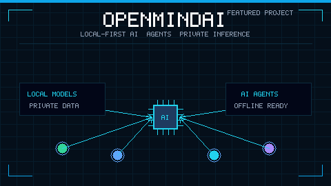
</a>
  

### [OpenMindAI](https://github.com/smshagor-dev/OpenMindAI)

A local-first AI desktop workstation for private on-device chat, model/runtime management, project workspaces, local agents, connected apps, media tools, portable storage, and maintenance workflows.

**Stack:** Rust · Tauri 2 · React · TypeScript · SQLite · llama.cpp

</td>
<td width="50%" valign="top">

<a href="https://github.com/smshagor-dev/AetherMotion">
  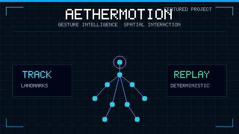
</a>
  

### [AetherMotion](https://github.com/smshagor-dev/AetherMotion)

A C++20 real-time gesture intelligence and spatial interaction platform with camera tracking, landmark smoothing, gesture classification, AR/fusion, telemetry, deterministic replay, and a Qt operator interface.

**Stack:** C++20 · OpenCV · MediaPipe · Qt6 · Go · Python

</td>
</tr>

<tr>
<td width="50%" valign="top">

  

### [B2B Global Trade](https://github.com/smshagor-dev/b2b_global_trade)

A production-oriented B2B export/import marketplace with supplier and buyer workflows, RFQs, quotations, real-time chat, search, subscriptions, analytics, verification, and admin operations.

**Stack:** Next.js · TypeScript · Prisma · MySQL · Redis · Socket.IO · Meilisearch

</td>
<td width="50%" valign="top">

<a href="https://github.com/smshagor-dev/Smart-Finance">
  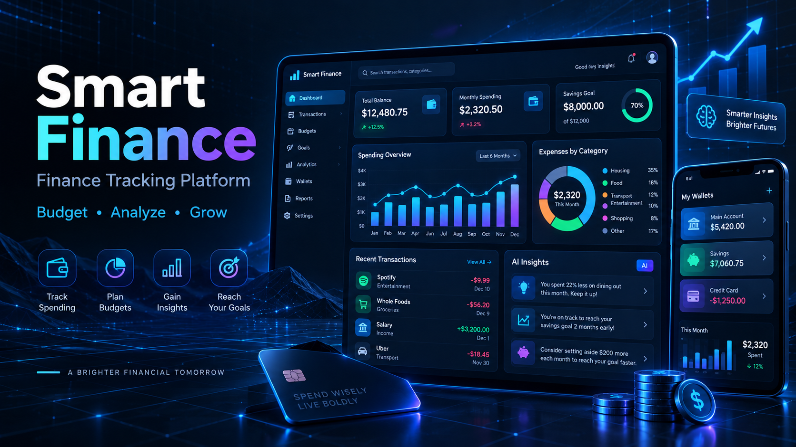
</a>
  

### [Smart Finance](https://github.com/smshagor-dev/Smart-Finance)

A full-stack finance platform for wallets, income and expenses, transfers, budgets, savings goals, debts, receipts, collaboration, reports, notifications, AI insights, and admin operations.

**Stack:** Next.js · React · Node.js · Prisma · MySQL · Recharts

</td>
</tr>

<tr>
<td width="50%" valign="top">

<a href="https://github.com/smshagor-dev/syncchat">
  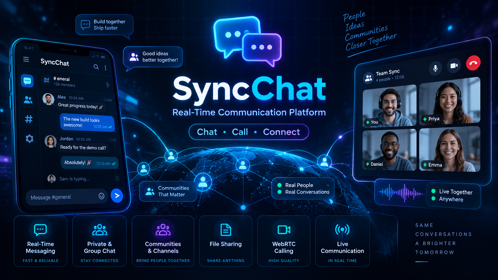
</a>
  

### [SyncChat](https://github.com/smshagor-dev/syncchat)

A real-time communication platform with private and group messaging, channels, communities, stories, file sharing, WebRTC calling, push notifications, moderation, and scalable Redis-backed realtime infrastructure.

**Stack:** React · Node.js · Express · Socket.IO · MongoDB · Redis · WebRTC

</td>
<td width="50%" valign="top">

<a href="https://github.com/smshagor-dev/s2s-translator">
  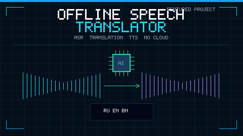
</a>
  

### [Offline Speech-to-Speech Translator](https://github.com/smshagor-dev/s2s-translator)

A fully offline Russian-English-Bengali speech translation prototype with a native C++ AI/audio pipeline, Go REST/WebSocket control layer, Python desktop client, and deterministic mock mode for end-to-end validation.

**Stack:** C++ · whisper.cpp · Piper · Go · WebSocket · Python

</td>
</tr>

<tr>
<td width="50%" valign="top">

<a href="https://github.com/smshagor-dev/Employee-Management-Workspace">
  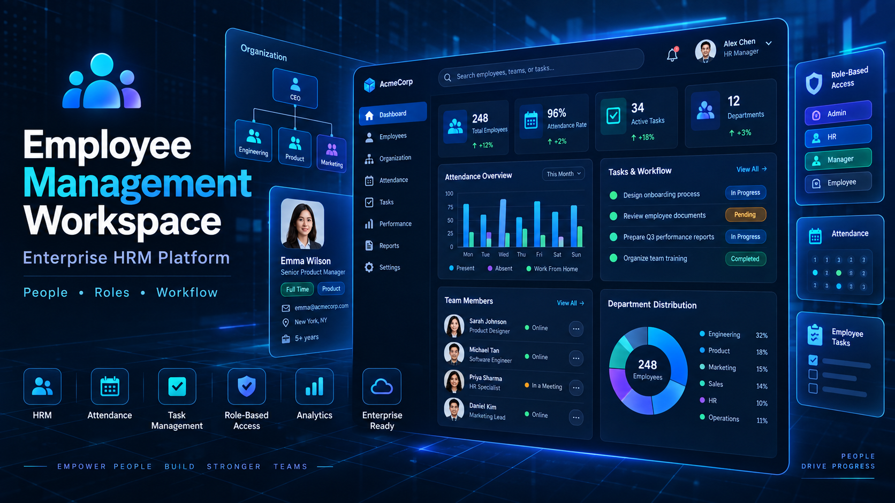
</a>
  

### [Employee Management Workspace](https://github.com/smshagor-dev/Employee-Management-Workspace)

An enterprise HRM workspace with role-based operations, JWT and 2FA authentication, background jobs, realtime updates, shared domain packages, deployment tooling, and production-oriented system documentation.

**Stack:** Next.js · NestJS · MongoDB · Redis · BullMQ · Socket.IO · Turborepo

</td>
<td width="50%" valign="top">

<a href="https://github.com/smshagor-dev/server-monitor">
  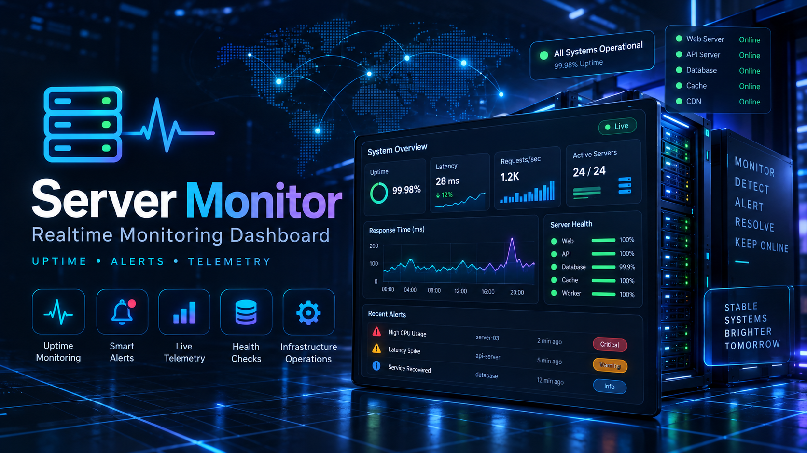
</a>
  

### [Server Monitor](https://github.com/smshagor-dev/server-monitor)

A real-time server and URL monitoring dashboard for health checks, latency tracking, live telemetry, authentication, and operational visibility with an optional Python system metrics agent.

**Stack:** React · TypeScript · Node.js · Socket.IO · Python · Docker · Nginx

</td>
</tr>
</table>

---

## <code>Tech Arsenal</code>

A work-aligned stack built from the technologies I use across **production web platforms, local-first AI, mobile and desktop applications, autonomous systems, edge computing, applied security, distributed systems, and research engineering**.

### Languages & Scripting

  

`TypeScript` · `JavaScript` · `Python` · `C++20` · `Go` · `PHP` · `Rust` · `Dart` · `Kotlin` · `Java` · `Bash` · `PowerShell`

### Web / UI / 3D

  

`HTML5` · `CSS3` · `React` · `Next.js` · `Tailwind CSS` · `Bootstrap` · `Material UI` · `Sass / SCSS` · `Vite` · `Three.js` · `Figma`

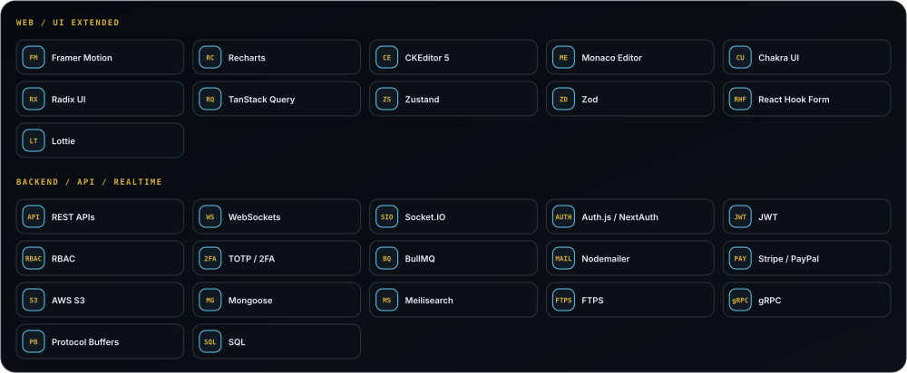

### Backend / Data / Platform Core

  

`Node.js` · `Express.js` · `Laravel` · `Strapi` · `PostgreSQL` · `MySQL` · `MongoDB` · `Redis` · `SQLite` · `Prisma ORM` · `Firebase`

### AI / ML / Computer Vision / Mobile / Native Core

  

`PyTorch` · `TensorFlow` · `Scikit-learn` · `OpenCV` · `Flutter` · `Android` · `Tauri` · `Raspberry Pi` · `Arduino` · `Qt` · `CMake`

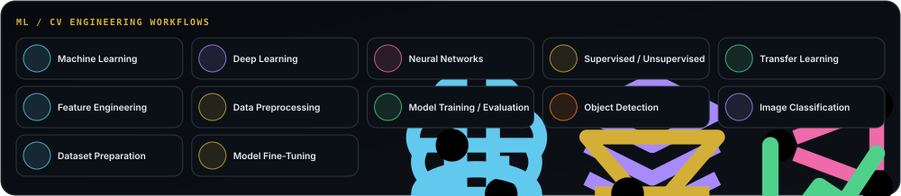

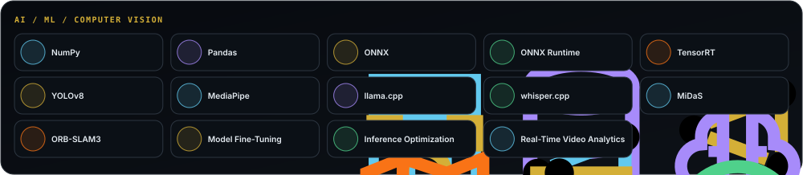

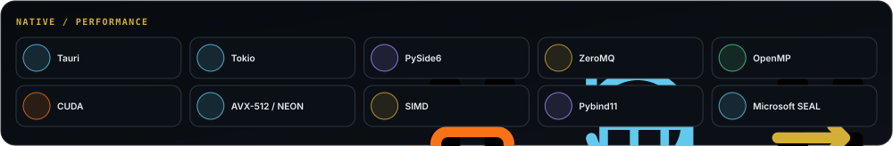

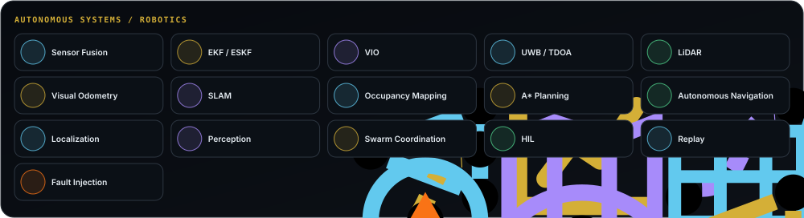

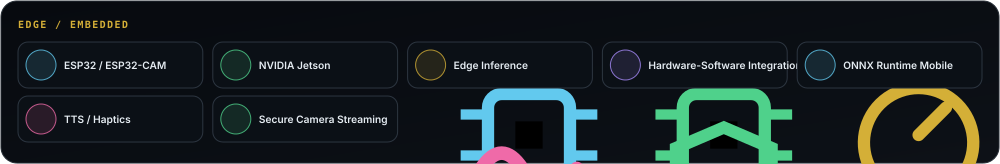

### Security / Cloud / Observability / Quality

  

`Docker` · `Nginx` · `Linux` · `Git` · `GitHub` · `GitHub Actions` · `AWS` · `Google Cloud` · `Kubernetes`

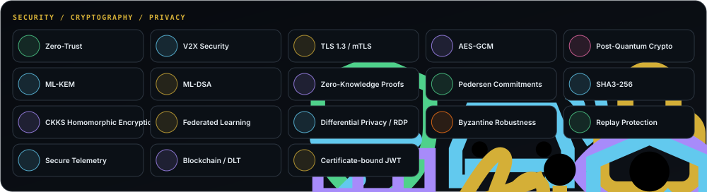

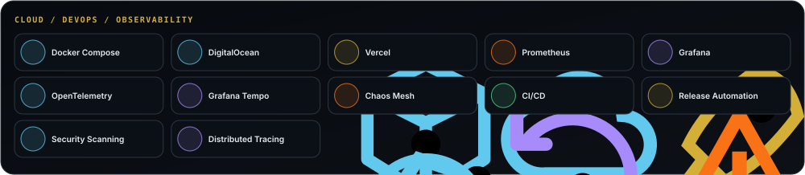

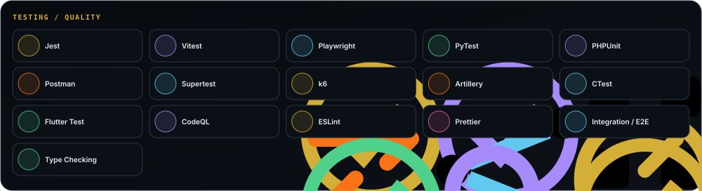

---

## <code>What I'm Up To</code>

| Signal | Current Focus |
|---|---|
| **Currently Building** | Production-grade AI applications, autonomous-system research prototypes, full-stack platforms, and offline/edge intelligence |
| **Researching** | Sensor fusion, trustworthy AI, autonomous localization, privacy-preserving ML, V2X security, and post-quantum systems |
| **Learning** | Better model optimization, resilient distributed architectures, robotics integration, and secure AI deployment |
| **Engineering Mindset** | Clean architecture, strong boundaries, measurable performance, security by design, automation, and maintainability |
| **Fun Fact** | I enjoy projects where software has to interact with the physical world, not just a browser tab |

---

## <code>GitHub Pulse</code>

---

## <code>Achievements</code>

 

Pull Shark ×3 · YOLO · Starstruck · Quickdraw

---

## <code>Socials</code>

  

 

<code>Scan to open my portfolio</code>

---

### <code>Build. Research. Secure. Automate.</code>

Designing software and intelligent systems for the web, the edge, and autonomous environments.

  

  

