

<a href="https://smshagor.com">
  
</a>

  
  
  
  
  
  
  

# <code>The Cipher Stack</code>

<table>
  <tr>
    <td width="43%" align="center" valign="top">
      
    </td>
    <td width="57%" align="center" valign="top">
      
    </td>
  </tr>
</table>

---

## <code>About Me</code>

I’m **Shahanur Islam Shagor**, a **Full-Stack Web Developer and AI / Autonomous Systems Engineer** focused on building dependable software and intelligent systems that connect the **web, AI, edge computing, and the physical world**.

My work spans **full-stack product engineering, machine learning, computer vision, autonomous systems, distributed architectures, and applied cybersecurity**. I enjoy taking complex problems from idea to implementation—designing the architecture, building the product, integrating intelligent components, validating performance, strengthening security, and shipping systems that are practical to use and maintain.

Across my projects, I have worked on **scalable web platforms, local-first AI applications, edge-AI systems, UAV navigation and sensor fusion, privacy-preserving machine learning, secure connected systems, and research-driven engineering prototypes**. What matters most to me is not adding technology for its own sake, but choosing the right engineering approach for the problem and making the result reliable in real-world conditions.

I approach engineering with a strong product and systems mindset: **clean architecture, secure-by-design decisions, measurable performance, maintainable code, thoughtful UI/UX, automation, and reliable deployment**. I’m especially interested in work where software must do more than function—it needs to be **useful, resilient, scalable, and technically sound**.

- Based in **Voronezh, Russia · UTC+3**
- Portfolio: **https://smshagor.com**
- GitHub: **@smshagor-dev**
- Email: **smshagor.dev@gmail.com**
- Core Focus: **Full-Stack Engineering · AI/ML · Autonomous Systems · Edge AI · Applied Security**

---

## <code>Contributions</code>

  

> Contribution data is generated automatically by the profile artwork workflow and refreshed daily.

---

## <code>Featured Gallery</code>

A curated selection of my strongest work across **AI systems, autonomous platforms, cybersecurity, privacy-preserving ML, edge intelligence, real-time software, and production-grade full-stack engineering**.

<table>
<tr>
<td width="50%" valign="top">

### [OpenMindAI](https://github.com/smshagor-dev/OpenMindAI)

<a href="https://github.com/smshagor-dev/OpenMindAI">
  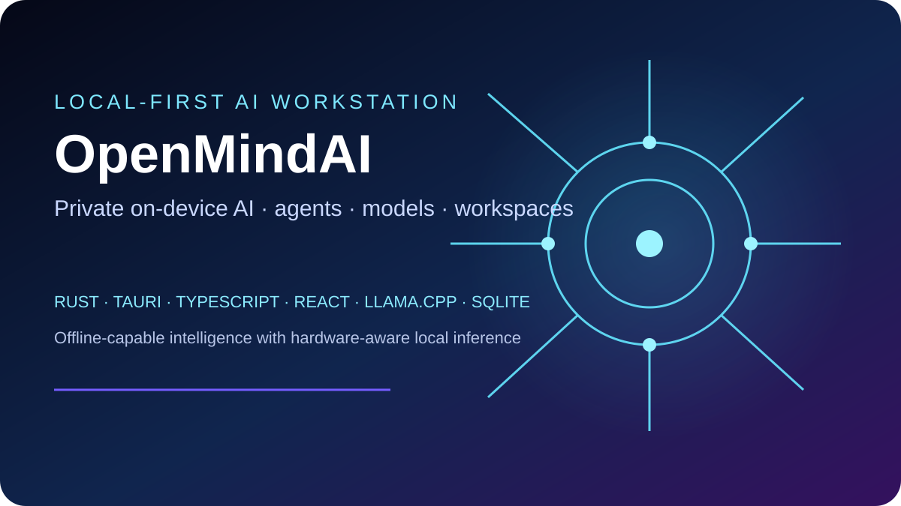
</a>

A local-first desktop AI workstation for private on-device inference, model and runtime management, agents, workspaces, portable storage, media workflows, and offline-capable intelligent assistance.

</td>
<td width="50%" valign="top">

### [ZeroTrust-FL-Sim](https://github.com/smshagor-dev/ZeroTrust-FL-Sim)

<a href="https://github.com/smshagor-dev/ZeroTrust-FL-Sim">
  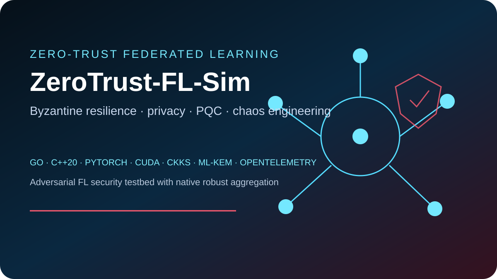
</a>

A zero-trust federated-learning security testbed combining Byzantine-robust aggregation, adversarial clients, differential privacy, CKKS, post-quantum transport, SIMD/CUDA acceleration, chaos engineering, and full observability.

</td>
</tr>

<tr>
<td width="50%" valign="top">

### [UAV GPS-Denied Navigation](https://github.com/smshagor-dev/UVA-GPS-Denied-Navigation-in-Dynamic-Environments)

<a href="https://github.com/smshagor-dev/UVA-GPS-Denied-Navigation-in-Dynamic-Environments">
  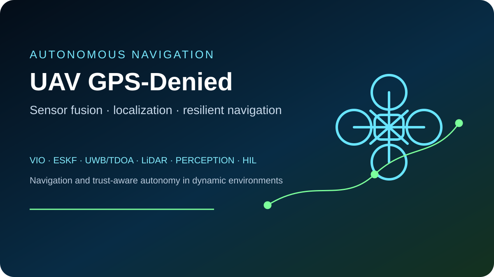
</a>

Autonomous UAV navigation for GPS-denied and dynamic environments using resilient localization, VIO, ESKF-based sensor fusion, UWB/TDOA, LiDAR-aware perception, fault injection, and deterministic validation workflows.

</td>
<td width="50%" valign="top">

### [AetherMotion](https://github.com/smshagor-dev/AetherMotion)

<a href="https://github.com/smshagor-dev/AetherMotion">
  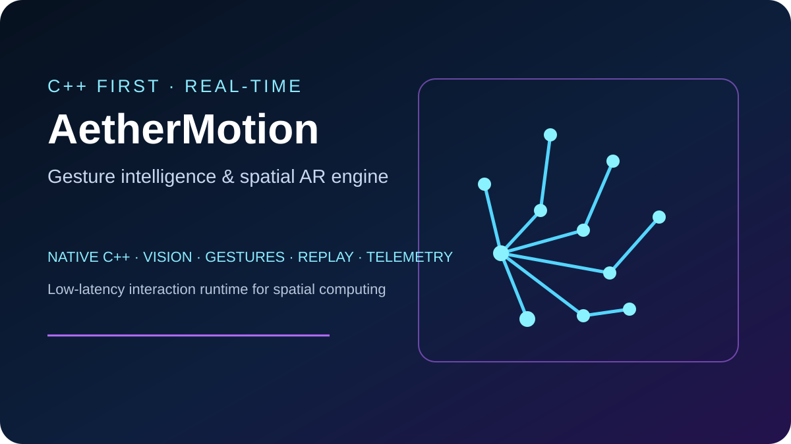
</a>

A C++-first real-time gesture intelligence and spatial AR engine with native vision pipelines, gesture classification, smoothing, spatial interaction, replay, telemetry, and low-latency runtime execution.

</td>
</tr>

<tr>
<td width="50%" valign="top">

### [Next-Gen V2X Security](https://github.com/smshagor-dev/Next-Gen-Blockchain-for-Vehicle-Security)

<a href="https://github.com/smshagor-dev/Next-Gen-Blockchain-for-Vehicle-Security">
  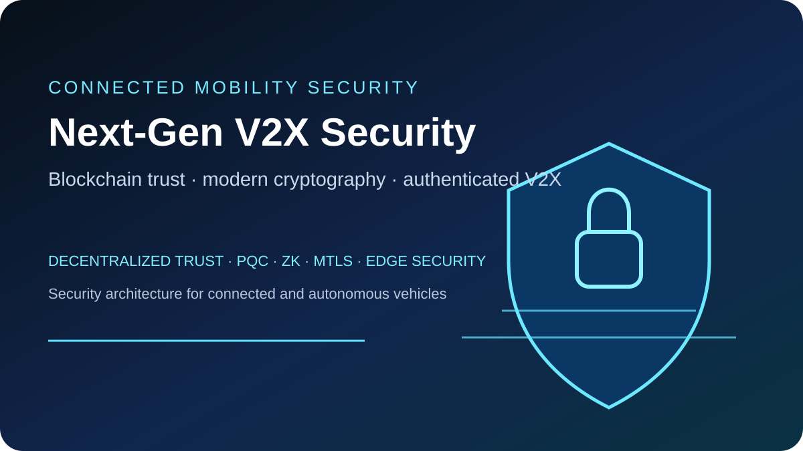
</a>

Applied vehicle-security research combining decentralized trust, modern cryptography, authenticated communication, post-quantum security concepts, and resilient architecture for connected mobility systems.

</td>
<td width="50%" valign="top">

### [Secure Autonomous Drone Swarms](https://github.com/smshagor-dev/decentralized-coordination-and-acoustic-localization-in-secure-autonomousa-drone-swarms)

<a href="https://github.com/smshagor-dev/decentralized-coordination-and-acoustic-localization-in-secure-autonomousa-drone-swarms">
  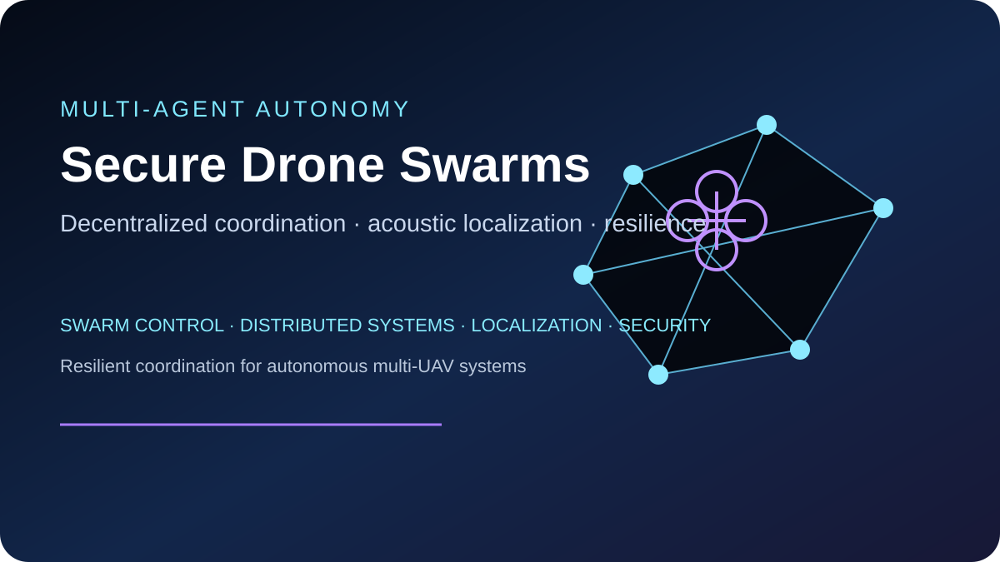
</a>

Multi-agent autonomy research spanning decentralized coordination, acoustic localization, secure communication, distributed decision-making, swarm resilience, and cooperative UAV behavior.

</td>
</tr>

<tr>
<td width="50%" valign="top">

### [WVAB — Wireless Vision Aid](https://github.com/smshagor-dev/wireless-Vision-Aid-for-the-blind)

<a href="https://github.com/smshagor-dev/wireless-Vision-Aid-for-the-blind">
  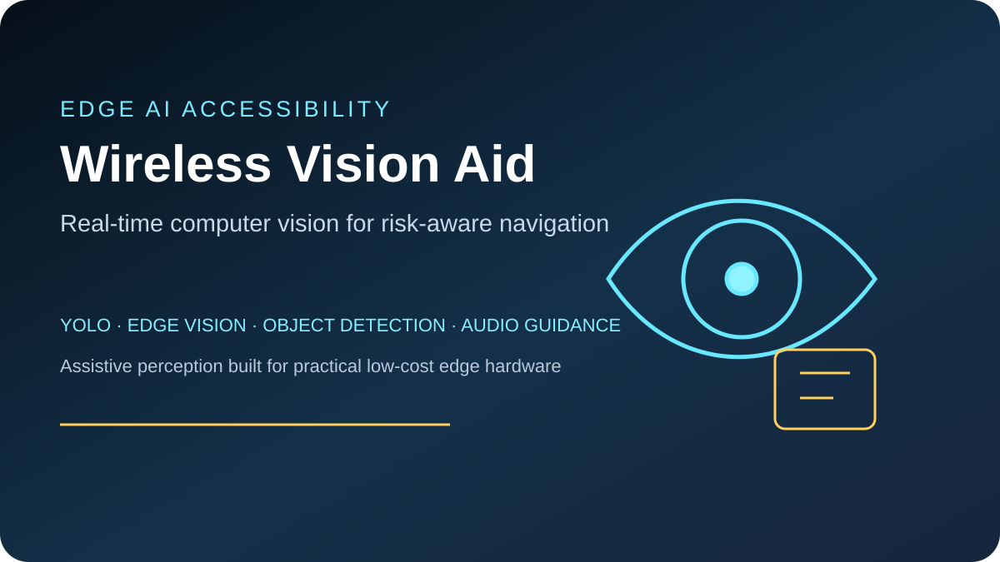
</a>

A low-cost edge-computer-vision assistive platform for real-time scene understanding, object detection, risk-aware navigation, wireless processing, and multilingual audio guidance for visually impaired users.

</td>
<td width="50%" valign="top">

### [CyberPhotonics-SPR](https://github.com/smshagor-dev/CyberPhotonics-SPR)

<a href="https://github.com/smshagor-dev/CyberPhotonics-SPR">
  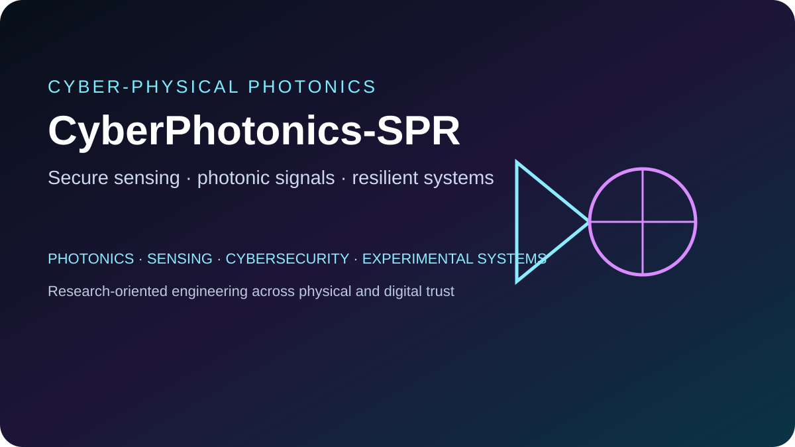
</a>

Research-oriented engineering at the intersection of photonic sensing, cyber-physical security, resilient system design, experimental validation, and software-backed secure sensing workflows.

</td>
</tr>

<tr>
<td width="50%" valign="top">

### [Federated Learning on Non-IID Data + Differential Privacy](https://github.com/smshagor-dev/Federated-Learning-on-Non-IID-Data-Differential-Privacy)

<a href="https://github.com/smshagor-dev/Federated-Learning-on-Non-IID-Data-Differential-Privacy">
  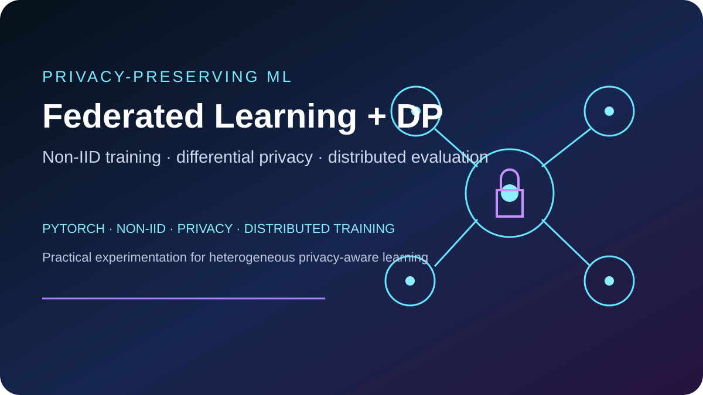
</a>

Privacy-preserving federated-learning experimentation for heterogeneous non-IID environments, combining distributed model training, differential privacy, evaluation, and practical ML analysis.

</td>
<td width="50%" valign="top">

### [B2B Global Trade](https://github.com/smshagor-dev/b2b_global_trade)

<a href="https://github.com/smshagor-dev/b2b_global_trade">
  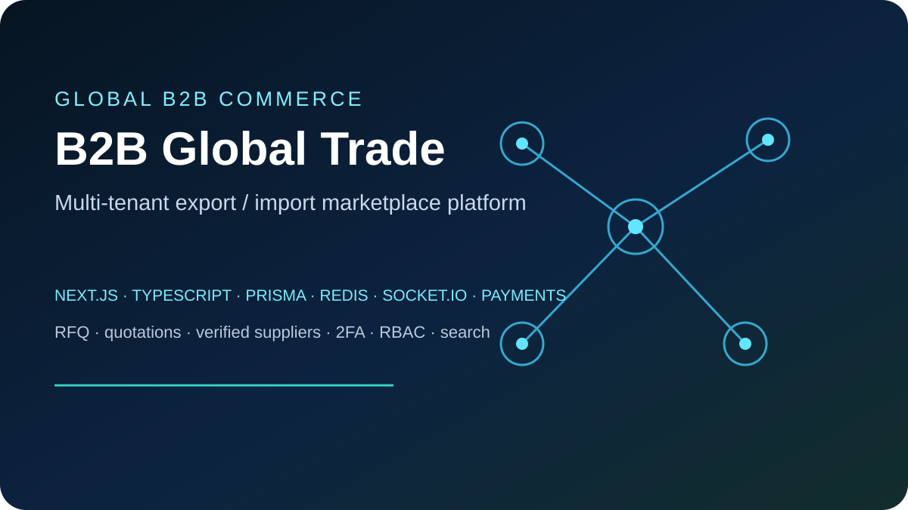
</a>

A production-oriented multi-tenant export/import marketplace with RFQs, quotations, supplier verification, live chat, advanced search, payments, 2FA, RBAC, analytics, queues, and Docker-based deployment architecture.

</td>
</tr>

<tr>
<td width="50%" valign="top">

### [SyncChat](https://github.com/smshagor-dev/syncchat)

<a href="https://github.com/smshagor-dev/syncchat">
  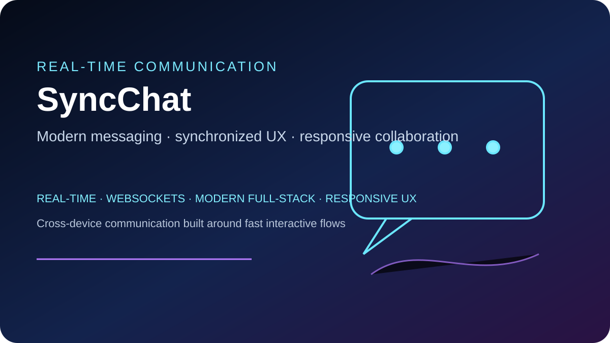
</a>

A modern real-time communication platform focused on synchronized messaging, responsive cross-device UX, production-oriented communication flows, and scalable full-stack architecture.

</td>
<td width="50%" valign="top">

### [CodeCraft](https://github.com/smshagor-dev/codecraft)

<a href="https://github.com/smshagor-dev/codecraft">
  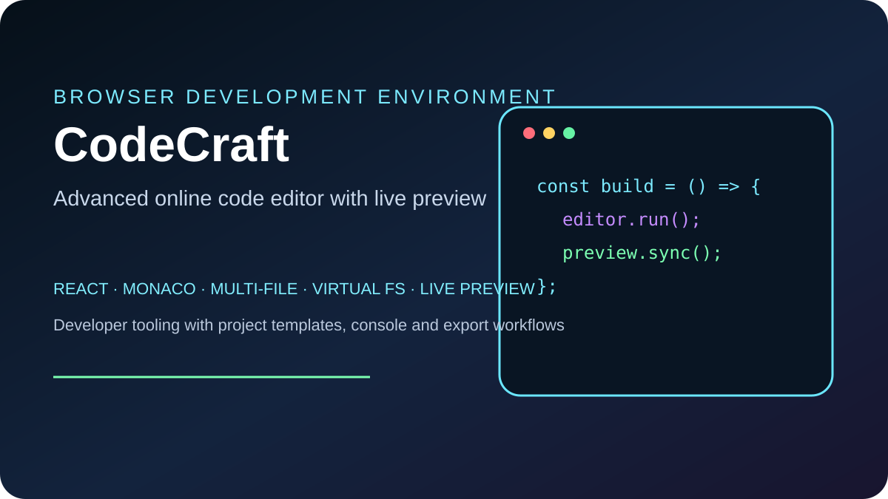
</a>

An advanced browser-based development environment with Monaco Editor, multi-file projects, a virtual file system, live preview, console tooling, project templates, import/export, and responsive developer workflows.

</td>
</tr>
</table>

---

## <code>Tech Arsenal</code>

### Programming Languages

  

`TypeScript` · `JavaScript` · `Python` · `C++20` · `Go` · `PHP` · `Rust`

### Frontend / 3D

  

`React` · `Next.js` · `Tailwind CSS` · `Three.js` · `HTML` · `CSS` · `Vite`

### Backend / Database

  

`Node.js` · `Express.js` · `Laravel` · `RESTful APIs` · `WebSockets` · `Socket.IO` · `SQL` · `PostgreSQL` · `MySQL` · `MongoDB` · `Redis` · `Prisma ORM`

### AI / Machine Learning / Computer Vision

  

`PyTorch` · `TensorFlow` · `Scikit-learn` · `OpenCV` · `NumPy` · `Pandas` · `ONNX` · `TensorRT` · `YOLOv8`

Machine learning · Deep learning · Neural networks · Supervised and unsupervised learning · Transfer learning · Feature engineering · Data preprocessing · Model training and evaluation · Inference optimization · Object detection · Image classification · Real-time video analytics · Dataset preparation · Model fine-tuning

### Autonomous Systems / Robotics

`Sensor Fusion` · `ESKF` · `VIO` · `UWB/TDOA Localization` · `LiDAR Integration` · `Autonomous Navigation` · `Localization` · `Perception Systems`

### Mobile / Edge Systems

  

`ESP32` · `Raspberry Pi` · `NVIDIA Jetson` · `Linux / ROS` · `Edge Inference` · `Hardware-Software Integration` · `whisper.cpp`

### Security / Applied Research

`V2X Security` · `Post-Quantum Cryptography` · `ML-KEM` · `Zero-Knowledge Proofs` · `Pedersen Commitments` · `mTLS` · `Federated Learning Prototypes`

### Tools / DevOps

  

`Docker` · `Nginx` · `Linux` · `Git / GitHub` · `CI/CD` · `AWS` · `Google Cloud` · `DigitalOcean`

### Testing / Quality

`Jest` · `PyTest` · `PHPUnit` · `Postman` · `Supertest` · `k6` · `Artillery`

---

## <code>What I'm Up To</code>

| Signal | Current Focus |
|---|---|
| **Currently Building** | Production-grade AI applications, autonomous-system research prototypes, full-stack platforms, and offline/edge intelligence |
| **Researching** | Sensor fusion, trustworthy AI, autonomous localization, privacy-preserving ML, V2X security, and post-quantum systems |
| **Learning** | Better model optimization, resilient distributed architectures, robotics integration, and secure AI deployment |
| **Engineering Mindset** | Clean architecture, strong boundaries, measurable performance, security by design, automation, and maintainability |
| **Fun Fact** | I enjoy projects where software has to interact with the physical world, not just a browser tab |

---

## <code>GitHub Pulse</code>

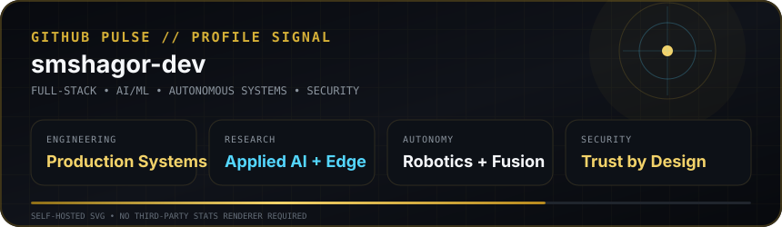

---

## <code>Achievements</code>

 

Pull Shark ×3 · YOLO · Starstruck · Quickdraw

---

## <code>Socials</code>

  

 

<code>Scan to open my portfolio</code>

---

### <code>Build. Research. Secure. Automate.</code>

Designing software and intelligent systems for the web, the edge, and autonomous environments.

  

  

