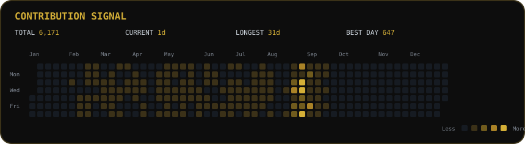

# <code>The Cipher Stack</code>

<table>
  <tr>
    <td width="43%" align="center" valign="top">
      
    </td>
    <td width="57%" align="center" valign="top">
      
    </td>
  </tr>
</table>

  
  
  

---

## <code>About Me</code>

I’m **Shahanur Islam Shagor**, a **Full-Stack Developer and AI / Autonomous Systems Engineer** focused on building scalable software, intelligent applications, edge-AI systems, autonomous platforms, and applied security research.

My work sits at the intersection of **web engineering, machine learning, computer vision, sensor fusion, embedded systems, robotics, distributed systems, and cybersecurity**. I care about clean architecture, measurable performance, maintainability, strong security boundaries, and turning complex ideas into systems that actually work.

- Based in **Voronezh, Russia · UTC+3**
- Portfolio: **https://smsagor.com**
- GitHub: **@smshagor-dev**
- Email: **smshagor.dev@gmail.com**
- Focus: **Full-Stack Engineering · AI/ML · Autonomous Systems · Edge AI · Applied Security**

---

## <code>Contributions</code>

  

> Contribution data is generated automatically by the profile artwork workflow and refreshed daily.

---

## <code>Featured Gallery</code>

<table>
<tr>
<td width="50%" valign="top">

### [UVA-GPS-Denied-Navigation-in-Dynamic-Environments](https://github.com/smshagor-dev/UVA-GPS-Denied-Navigation-in-Dynamic-Environments)

Autonomous navigation research for UAV operation in GPS-denied and dynamic environments, centered on robust localization, perception, sensor fusion, and resilient navigation pipelines.

</td>
<td width="50%" valign="top">

### [Next-Gen-Blockchain-for-Vehicle-Security](https://github.com/smshagor-dev/Next-Gen-Blockchain-for-Vehicle-Security)

Applied vehicle-security research combining decentralized trust, modern cryptography, authenticated communication, and security architecture for connected mobility systems.

</td>
</tr>

<tr>
<td width="50%" valign="top">

### [Federated-Learning-on-Non-IID-Data-Differential-Privacy](https://github.com/smshagor-dev/Federated-Learning-on-Non-IID-Data-Differential-Privacy)

Federated-learning experimentation for non-IID environments with privacy-preserving training, differential privacy, distributed evaluation, and practical ML analysis.

</td>
<td width="50%" valign="top">

### [wireless-Vision-Aid-for-the-blind](https://github.com/smshagor-dev/wireless-Vision-Aid-for-the-blind)

Edge-computer-vision assistive system exploring real-time scene understanding, object detection, wireless processing, and accessible guidance for visually impaired users.

</td>
</tr>

<tr>
<td width="50%" valign="top">

### [OpenMindAI](https://github.com/smshagor-dev/OpenMindAI)

A local-first AI platform designed around private on-device intelligence, model orchestration, practical assistant workflows, and offline-capable experiences.

</td>
<td width="50%" valign="top">

### [CyberPhotonics-SPR](https://github.com/smshagor-dev/CyberPhotonics-SPR)

Research-oriented security engineering exploring cyber-physical and photonic sensing concepts, resilient system design, and software-backed experimental workflows.

</td>
</tr>

<tr>
<td width="50%" valign="top">

### [decentralized-coordination-and-acoustic-localization-in-secure-autonomousa-drone-swarms](https://github.com/smshagor-dev/decentralized-coordination-and-acoustic-localization-in-secure-autonomousa-drone-swarms)

Secure multi-agent autonomy research spanning decentralized coordination, acoustic localization, swarm resilience, and distributed decision-making.

</td>
<td width="50%" valign="top">

### [syncchat](https://github.com/smshagor-dev/syncchat)

A real-time communication project focused on synchronized messaging, modern full-stack architecture, responsive UX, and production-oriented communication flows.

</td>
</tr>
</table>

---

## <code>Tech Arsenal</code>

### Programming Languages

  

`TypeScript` · `JavaScript` · `Python` · `C++20` · `Go` · `PHP` · `SQL`

### Frontend / 3D

  

`React` · `Next.js` · `Tailwind CSS` · `Three.js` · `HTML` · `CSS` · `Vite`

### Backend / Database

  

`Node.js` · `Express.js` · `Laravel` · `RESTful APIs` · `WebSockets` · `Socket.IO` · `PostgreSQL` · `MySQL` · `MongoDB` · `Redis` · `Prisma ORM`

### AI / Machine Learning / Computer Vision

  

`PyTorch` · `TensorFlow` · `Scikit-learn` · `OpenCV` · `NumPy` · `Pandas` · `ONNX` · `TensorRT` · `YOLOv8`

Machine learning · Deep learning · Neural networks · Supervised and unsupervised learning · Transfer learning · Feature engineering · Data preprocessing · Model training and evaluation · Inference optimization · Object detection · Image classification · Real-time video analytics · Dataset preparation · Model fine-tuning

### Autonomous Systems / Robotics

`Sensor Fusion` · `ESKF` · `VIO` · `UWB/TDOA Localization` · `LiDAR Integration` · `Autonomous Navigation` · `Localization` · `Perception Systems`

### Mobile / Edge Systems

  

`ESP32` · `Raspberry Pi` · `NVIDIA Jetson` · `Linux / ROS` · `Edge Inference` · `Hardware-Software Integration` · `whisper.cpp`

### Security / Applied Research

`V2X Security` · `Post-Quantum Cryptography` · `ML-KEM` · `Zero-Knowledge Proofs` · `Pedersen Commitments` · `mTLS` · `Federated Learning Prototypes`

### Tools / DevOps

  

`Docker` · `Nginx` · `Linux` · `Git / GitHub` · `CI/CD` · `AWS` · `Google Cloud` · `DigitalOcean`

### Testing / Quality

`Jest` · `PyTest` · `PHPUnit` · `Postman` · `Supertest` · `k6` · `Artillery`

---

## <code>What I'm Up To</code>

| Signal | Current Focus |
|---|---|
| **Currently Building** | Production-grade AI applications, autonomous-system research prototypes, full-stack platforms, and offline/edge intelligence |
| **Researching** | Sensor fusion, trustworthy AI, autonomous localization, privacy-preserving ML, V2X security, and post-quantum systems |
| **Learning** | Better model optimization, resilient distributed architectures, robotics integration, and secure AI deployment |
| **Engineering Mindset** | Clean architecture, strong boundaries, measurable performance, security by design, automation, and maintainability |
| **Fun Fact** | I enjoy projects where software has to interact with the physical world, not just a browser tab |

---

## <code>GitHub Pulse</code>

---

## <code>Achievements</code>

 

Pull Shark ×3 · YOLO · Starstruck · Quickdraw

---

## <code>Socials</code>

  

 

<code>Scan to open my portfolio</code>

---

### <code>Build. Research. Secure. Automate.</code>

Designing software and intelligent systems for the web, the edge, and autonomous environments.

  

  

